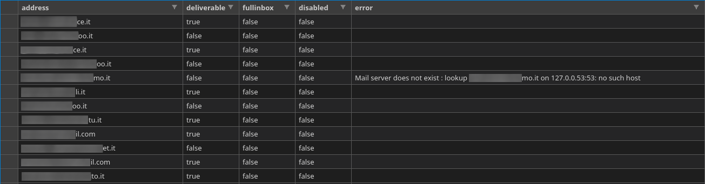

mailcheck is a simple tool to concurrently validate email addresses and their deliverability and export results to CSV.

### Screenshots

<p></p>

### Considerations

As most providers reject emails from residential IP addresses, it is recommended to use this tool on a suitable environment or to keep an eye out for the errors reported in the output file.

Moreover, many also filter senders based on how many connections they're establishing over time, their failure rate and HELO/MAIL FROM strings. If you're not happy with the defaults in your scenario, tune them to your preference.

### Usage

Provide a file with one email address per line.

#### Standalone

```
$ make build
[...]
$ bin/mailcheck -h
mailcheck version v1.1.0
Usage of bin/mailcheck:
  -f string
    	email address for SMTP MAIL FROM command (default "mailcheck@no-reply.net")
  -h	show usage
  -i string
    	input file name (default "addresses.txt")
  -j int
    	maximum number of workers for concurrent processing (default 10)
  -n string
    	name for SMTP HELO command (default "no-reply.net")
  -o string
    	output CSV file name (default "mailcheck.csv")
  -q	quiet (suppress progress output)
$ 
```

#### Docker
```
$ docker build -t markkuit/mailcheck .
[...]
$ touch mailcheck.csv
$ docker run --rm -ti -v $(pwd)/addresses.txt:/tmp/addresses.txt -v $(pwd)/mailcheck.csv:/tmp/mailcheck.csv markkuit/mailcheck -i /tmp/addresses.txt -o /tmp/mailcheck.csv -h
mailcheck version v1.1.0
Usage of /mailcheck:
  -f string
    	email address for SMTP MAIL FROM command (default "mailcheck@no-reply.net")
  -h	show usage
  -i string
    	input file name (default "addresses.txt")
  -j int
    	maximum number of workers for concurrent processing (default 10)
  -n string
    	name for SMTP HELO command (default "no-reply.net")
  -o string
    	output CSV file name (default "mailcheck.csv")
  -q	quiet (suppress progress output)
$ 
```